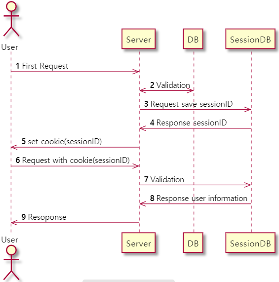

# js-session-playground

session을 이용하여 사용자 인증절차 구현

## Flow

- ;

## User Table

```
+----------------+-------------+------+-----+---------+----------------+
| Field          | Type        | Null | Key | Default | Extra          |
+----------------+-------------+------+-----+---------+----------------+
| id             | int         | NO   | PRI | NULL    | auto_increment |
| user_name      | varchar(45) | NO   | UNI | NULL    |                |
| user_github_id | int         | NO   | UNI | NULL    |                |
+----------------+-------------+------+-----+---------+----------------+
```
